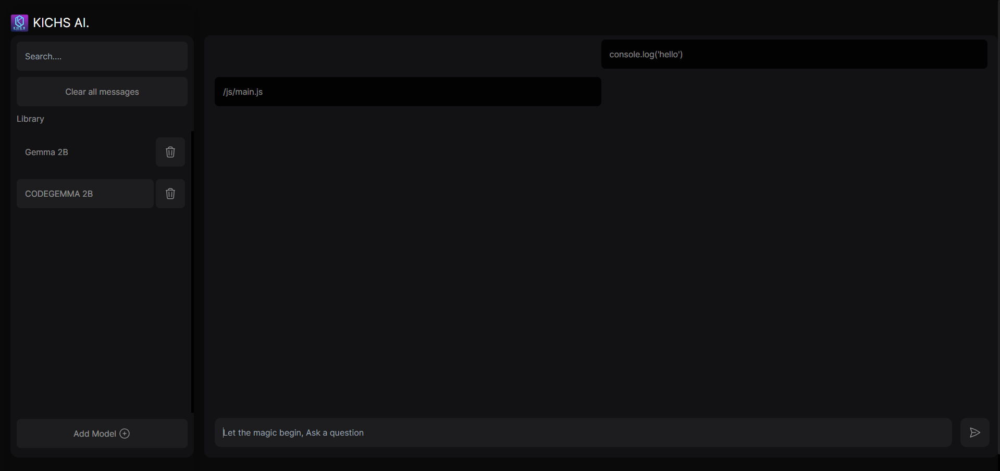
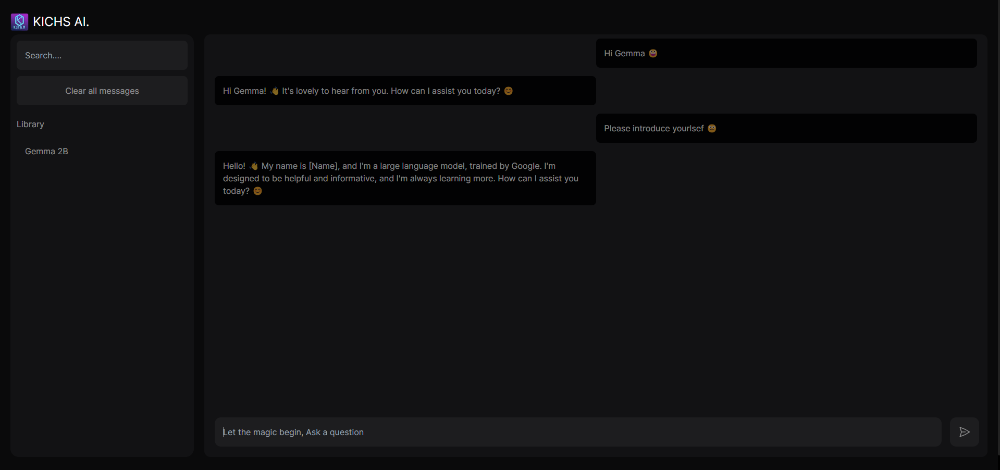

<h2>AI Chat Interface with Next.js and Tailwind CSS</h2>


This project is an AI-powered chat interface developed using Next.js and Tailwind CSS. It allows users to interact with an artificial intelligence model similar to ChatGPT, generating responses based on user input. However, to utilize the AI model, you need access to the [Ollama](https://ollama.com/) platform, which includes the Gemma:2b model.

---
Greetings, this project is now dynamically compatible with all of Ollama's text models. The sidebar has been updated, allowing you to add your models and easily switch between your downloaded models.

When you download and run this project it will automaticly  check Ollama's existence, Ollama's status (is running or not), Gemma:2b model's existence and it will guide you to follow the instructions to start chatting.

---

If you don't have ollama and the gemma:2b model, after downloading this interface, simply follow the instructions below to start chatting.

Firstly, you need to download and install ollama. Here is the [download link](https://ollama.com/download). After installation, open your command prompt and type 'ollama'. This will display all ollama commands. Then, you can execute the following command: ```ollama pull gemma:2b```. This command will automatically download and run the gemma:2b model.

Once you have completed all these steps, you can launch the interface and start chatting with the gemma:2b model.

I'd like to mention that I'll continue developing this project. Additionally, it will be made compatible with other ollama models. Users will be able to select the loaded model via the sidebar and engage in conversation based on the chosen model. This will allow users to interact with their preferred model and experience a broader range of capabilities.

---


